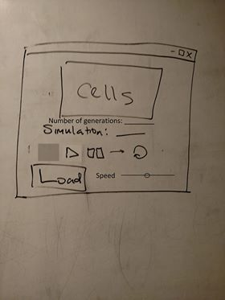
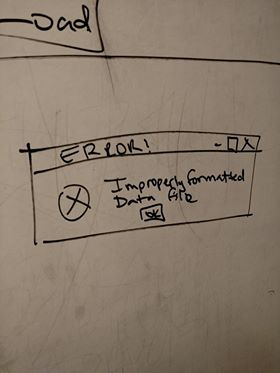
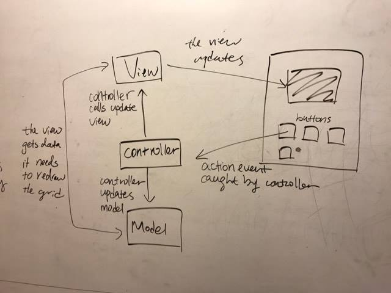

**Compsci 308: CellSociety DESIGN**
========================
INTRODUCTION
--------------
The primary goal of this project is to design a program that can run several pre-defined cellular automata models. The user will be able to specify the initial states and parameters of the models. The project will be designed such that it will be simple to add new types of models (rules, agents, number of neighbors, and states). The algorithms based on the rules specified for each model will be closed, but the parameters and initial states will be open for the user to set. 
OVERVIEW
----------
A Main class will launch the application. A Loader class will read the XML data file and set the initial states and parameters of the simulation. Data files read by the Loader will contain the total number of rows and columns, each possible initial state, and the fraction of the total number of cells that correspond to each state. The Loader will instantiate all the Cells (loadXML()) and instantiate the Cells in a 2D array, to make linking easier. It will pass a list of these Cells to the Controller each time it is initialized. 

The agents will extend a Cell abstract class. So for the four given simulations, we plan on having four extensions of the Cell class (SegregationCell, WaTorCell, FireCell, and ConwayCell). Each implementation of the Cell class will include its own method to update its state (update()). A Cell will also know its coordinates, its neighbors, its current state, next state, all possible states, and the color of each state in the GUI. Setter and getter methods will be set for each of these. There will be one Cell per simulation. We chose to do this implementation because it makes it rather simple to add a new simulation--one would simply have to write a new class which extends our Cell class and write their own update method, and update the Loader class to prepare itself for an XML file with inputs for the according new simulation.  

A Controller class will control all the Cells. The Controller will take the output from the Loader class and store it as a list of Cells, so it will know the locations and stats of all of the Cells. On each iteration, the controller will call on each of the Cells to update itself. This design ensures that to create a new model, only new implementations of Cell will have to be made. In addition, the Controller will initialize a few buttons to change the simulation, change the input file, adjust the parameters, and control the simulation (play, pause, reset, step). Once the action events are triggered in the GUI, they will be caught by the Controller. 

Another View class will be created to house the UI. It will contain the main window, and will read from the Controller to update the screen. View will also display options to change the simulation, change the input file, adjust the parameters, and control the simulation (play, pause, reset, step). These will be communicated to the Controller. 

USER INTERFACE
----
The UI will have a central window where the simulation will be displayed. The simulation will be updated by methods in the View class. Toolbars around the central window will activate the play, pause, and reset features; loading of new simulation files; and changing the simulation type. 

The cells will be displayed in the large box labeled “Cells”. Text under the display will indicate what type of simulation is running, and how many generations have elapsed. Play, pause, step, and reset buttons are located in that order in the next line. At the bottom, there is a Load button to load in a new XML file. A slider at the bottom also the controls.  

If the user inputs incorrect or empty data, a dialog box will pop up that says the data is formatted incorrectly. The simulation text will be blank, and the cells display will just be a black screen. The program will work as normal once the user loads a properly formatted data file.  

DESIGN DETAILS
---
The Loader class will load XML files with standard file I/O and instantiate a list of Cells to pass on to the Controller class to handle for remainder of the simulation. We plan on using the SAXParser library, which will make reading information and creating Cells easy, to parse through the XML document and extract all necessary data. 

Each Cell in the model, when update is called, will examine its own current states as well as current states of each neighbor. Based on the rules defined in the update method, it will change its next state, while retaining its current state. Under this design, the extension of each preexisting cell type to include additional rules requires additional rules to be defined in the update method or its helper methods. For an extension in the sense of a different cell type with a completely different set of rules, all that needs to be added is a separate file defining a different cell type with its own update method and helper methods, with a minor addition to the Loader class to allow for this Cell to be created from the XML file.  

Once all states are updated by the update method, the next state will become the current state, and the value held by next state will be set to prepare for the next iteration. All this information will be ready to be passed on from the controller to the view. This ensures that all cells update according to the information contained in the same generation.  

Since each Cell stores a list of all of its neighbors, implementation of this process will be simple. All Cells will also have the same number of neighbors, which will help the View determine what shape to use in the display. Cells on the edge will have null neighbors, and when these Cells update themselves, the update method will ignore null neighbors. This design also reduces the amount of information that will be stored in the Controller. This design also prevents the simulation from being confined to any particular cell shape, as each Cell can have any number of neighbors.  
	
The View will take the list of the Cells and display that information on the screen, using the Cell's’ coordinates and current states. When the View is first created, it will use the coordinates to generate a grid. Based on the number of neighbors, the View will be able to determine what shape the Cells should be. On each iteration, the View will read the current color of each Cell, and update that on the screen. The View also pass on action events from buttons to the Controller.  

The Controller will get a list of all of the Cells from the Loader, and on each iteration, will go through the list and call each cell to update itself. This prevents the Controller class from becoming cluttered with simulation update methods. Buttons will live in the Controller, allowing user to interact with the simulation (stop, play, reset, new simulation, etc.). If the user chooses to pause or play the simulation, the loop within the controller will stop or start respectively. The speed of the simulation can be adjusted by a slider.  
**USE CASES**
1. Apply the rules to a middle cell: set the next state of a cell to dead by counting its number of neighbors using the Game of Life rules for a cell in the middle (i.e., with all its neighbors).  

Upon calling the update method of a cell in the Game of Life model for a cell, the neighbors of the cell, which are available in a list stored by the cell, will be analyzed for their states. Given the number of neighbors and their given states, as well as the state of the cell itself, the cell’s state will be updated based on its assigned behavior. In this case, if the number of living neighbors is fewer than 2, since the cell is alive, the cell’s next state will be set to dead. Meanwhile, it’s current state will be held without changing for use by other cells to determine their next states.  
2. Apply the rules to an edge cell: set the next state of a cell to live by counting its number of neighbors using the Game of Life rules for a cell on the edge (i.e., with some of its neighbors missing)  

If a Cell is on the edge, the neighbors on the sides that are touching the edge will be null. The update method will check to make sure that the neighbor is not null before attempting to access the neighbor’s state. 

3. Move to the next generation: update all cells in a simulation from their current state to their next state and display the result graphically.  

The Controller class will handle updating all cells in a simulation by iterating through the list of cells (an instance variable stored in the Controller class), and calling the update method for each cell. Since each cell stores its current state and next state (both as instance variables), the update method will use the cell’s current state, as well as its neighbors’ current states, to determine its next states. After fully iterating through the list, we can go back and set each cell’s current state to next state, and reset next state to null in preparation for the next iteration. Once this is done, we can pass our list of Cells to the View class which will know how to display each Cell in the window as each Cell will contain information on its x and y positions and color.  

4. Set a simulation parameter: set the value of a parameter, probCatch, for a simulation, Fire, based on the value given in an XML file  

The Loader class will parse the value of probCatch given in the XML file and pass it to the Fire Cell class when it is initializing the list of all Fire Cells. Each of the Fire Cell will store that value as one of its private instance variables.  

Once this parameter is updated in the XML file, the file will have to be reloaded. This action will be collected by the Controller, which will create a Loader object to load the updated XML file. This will create Cells and store them in a list and pass them back to the Controller, which will update the view. The simulation will then be ready to run.  

5. Switch simulations: use the GUI to change the current simulation from Game of Life to Wator  

Our GUI will allow the user to load a new XML file whenever the user chooses to do so. So, if the user wanted to switch simulations to the Wator file while running a simulation from Game of Life, the user would click the “Load” button in our window and choose the appropriate XML file.  
DESIGN CONSIDERATION
----
The overall design pattern follows the MVC model in which the Model (abstract Cell class, its many subclasses and the rules of the simulation), View and Controller are separate from one another. Specifically, the Model only knows how to compute the solution, i.e. having methods that use the rules to update the cells. It does not know how to change the View nor does it know about the events and GUI.   
The View displays of the results of each update, and the Controller only knows how to initialize all its components and manage the events. The View and Model will communicate to each other through the Controller. We adopted this model so that the frontend and backend implementation could be well separated to introduce flexibility into the design. It will also prevent either the frontend or the backend from having too much control over the entire program.  

We decided to let the Loader class load XML files with standard file I/O and instantiate a list of Cells to pass on to the Controller class to handle for remainder of the simulation instead of creating that list in the Controller because it is likely that our Controller will be more lengthy than the other classes and we want to delegate some tasks to the Loader.  

We chose not to have an actual Grid class that stores all the Cells. First of all, such a class will not be necessary because essentially the Controller and methods written in the Cell class will take care of updating the states of Cells. Initializing a Grid object in the Controller class and only using it to get all the Cells would be a complete waste. Secondly, to allow future addition of simulations and potentially various shapes of Cells to be displayed, it is better not to have a rigid Grid class that constrains the amount of possibilities.  

For resetting the simulation, we chose to reload the XML file again and reinitializing all the initial states of the Cells. An alternative that we thought about was making a copy of the list when it was first created and use that when the user wants to reset the simulation. But considering that the Controller would have to keep that one copy even if it is not needed at all, we decided to reload and reinitialize because that probably would not take too much time.  

TEAM RESPONSIBILITIES
----
Conway Cell (Gabriel, Bihan): 2/1/17 7PM 
Spreading Fire Cell (Vishnu): 2/1/17 7PM  
Wator Cell (Hari): 2/1/17 7PM  
Segregation Cell (Gabriel, Bihan): 2/1/17 7PM  
Cell Superclass (All) 1/29/17 
Loader Class (Hari) 2/6/17 
Controller Class (Vishnu, Bihan): 2/6/17  
View Class (Gabriel): 2/6/17  

